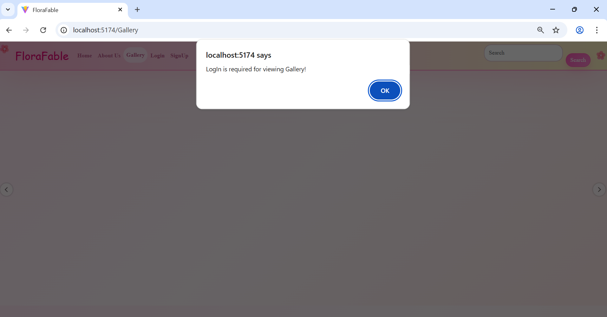
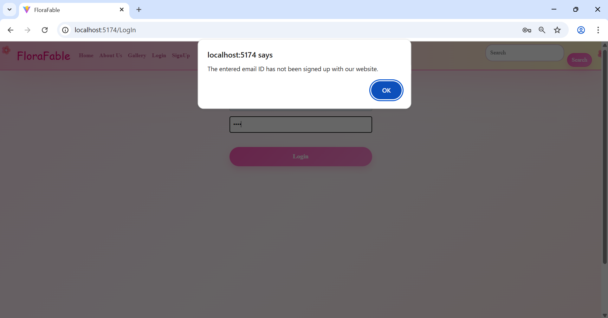
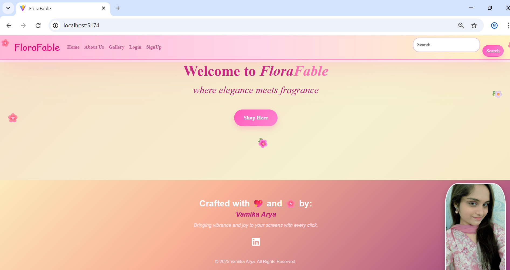
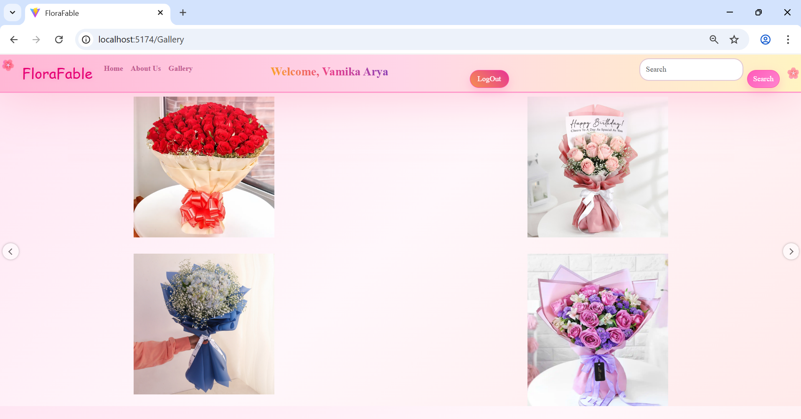
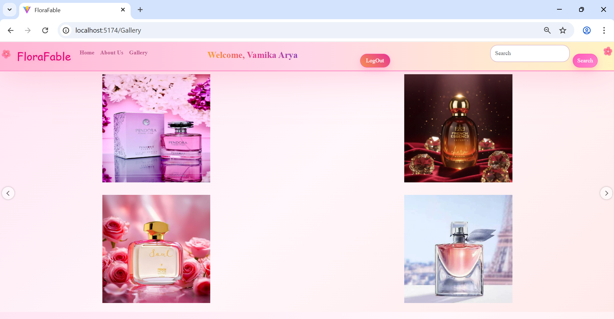
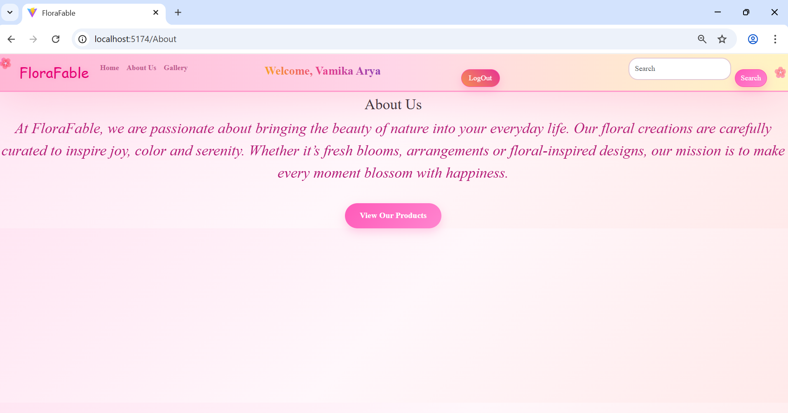

# FloraFable 🌸

**FloraFable** is a mesmerizing, floral-themed React based website designed to bring the petals of grace, fragrance of nature and taste of joy to your daily experience. 

---

## Table of Contents
- [Project Description](#project-description)
- [Features](#features)
- [Technologies Used](#technologies-used)
- [User Authentication Logic](#user-authentication-logic)
- [License](#license)

---

## Project Description

FloraFable is a React.js application featuring multiple pages for a smooth user experience:  

- **Home** – A welcome page with eye pleasing color theme with information about creator.  
- **Gallery** – Showcase of products comprising flowers, cakes, perfumes, scented candles,etc.  
- **LogIn / SignUp** – Secure user authentication pages.  
- **About Us** – Information about the website.  

---

## Features

- 🌸 Multi-page React app with routing.  
- 🌸 Gradient backgrounds and floral color theme.  
- 🌸 Strong User Authentication Logic.
- 🌸 Responsive design for desktop and mobile.    

---

## Technologies Used

- **React.js** – Frontend framework  
- **React Router DOM** – Page navigation  
- **CSS** – Styling and layout  
- **React Icons** – Social icons  
- **HTML5 and JavaScript** – Structure and interactivity  
- **Better React Carousel** – Gallery Formation
- **React Hooks** – Navigation and User Authentication Logic
---

## 🛡️ User Authentication Logic

The **Gallery** section, which displays products, is accessible **only to logged-in users**. 👀

User details are stored using the **`localStorage`** object from the Web Storage API during signup, and these details are later used for validation. 💾

### 📝 Signup and Login Validations
- ⚠️ A warning is displayed if the **confirm password** field does not match the password during signup.  
- ⚠️ If a user tries to sign up with an already registered email, a warning is shown.  
- ❌ During login, a warning appears if the user enters an incorrect password.  

### 🌐 Navbar Changes
- Before login, the Navbar displays **Sign Up** and **Log In** buttons.  
- After login, the Navbar changes to show a **Welcome** button and a **Log Out** button. 👋  
- Logging out is handled by **removing the user's details from `localStorage`**. 🗑️

### ℹ️ About Us Section
- The About Us section contains a **View Our Products** button. 🛍️  
- If the user is logged in, clicking the button redirects them to the Gallery section.  
- If not logged in, the button prompts the user to log in first. 🔑

### ✅ Login User Verification
- User existence is verified by checking **data stored in `localStorage`**. 📂

---

### 📸 Screenshots of website

## License

This project is **open source** and free to use.  

© 2025 **Vamika Arya**. All Rights Reserved.

